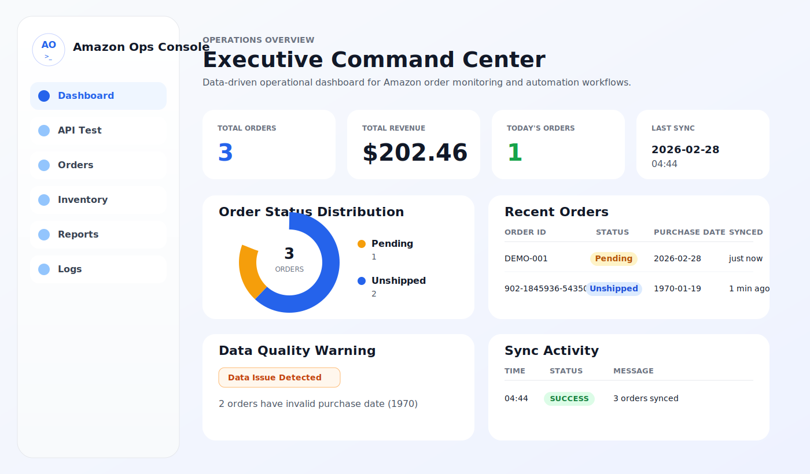

# Amazon Ops Console

Amazon Ops Console is a React + Vite operations console frontend for viewing Amazon order operation data, checking API health, and running sandbox sync tasks.

This project is not a demo-only page. It is structured to resemble a practical operations UI focused on:

- Order data monitoring
- Operations KPI visualization
- API health checks
- Sandbox order sync testing
- Order data reset and validation

## Screenshot

The image below is a README preview that shows the current UI structure.



## Key Features

- `Dashboard`
  - Displays KPIs, status distribution, recent orders, and data-quality warnings based on Orders API data.
- `Orders`
  - Provides an order table, detail panel, sandbox sync, and delete-all-orders action.
- `Inbound`
  - Provides inbound list/detail views, draft editing, receiving checks, putaway saving, and workflow completion actions.
- `Inventory`
  - Provides an inventory list, status filters, stock adjustments, transaction ledger, and negative-stock validation.
- `Warehouse Tasks`
  - Provides a warehouse task queue, status filters, next-step action buttons, and progress indicators.
- `API Test`
  - Calls the backend health endpoint (`/dashboard/health`) directly to check service status.
- `White / Dark` Theme
  - Switches global theme from the top toggle and stores preference in local storage.

## Tech Stack

- React 19
- Vite 7
- Plain CSS (no external UI framework)
- Fetch API
- Hash-based client navigation

## Project Structure

```text
amzops_console/
├─ docs/
│  └─ screenshots/
│     └─ dashboard-preview.svg
├─ public/
│  └─ vite.svg
├─ src/
│  ├─ api/
│  │  ├─ health.js
│  │  ├─ inbound.js
│  │  ├─ inventory.js
│  │  ├─ orders.js
│  │  └─ warehouse.js
│  ├─ components/
│  │  └─ layout/
│  │     ├─ PageHeader.jsx
│  │     └─ Sidebar.jsx
│  ├─ pages/
│  │  ├─ ApiTest/
│  │  │  └─ ApiTestPage.jsx
│  │  ├─ Dashboard/
│  │  │  └─ DashboardPage.jsx
│  │  ├─ Inbound/
│  │  │  └─ InboundListPage.jsx
│  │  ├─ Inventory/
│  │  │  └─ InventoryPage.jsx
│  │  ├─ Orders/
│  │  │  └─ OrdersPage.jsx
│  │  └─ Warehouse/
│  │     └─ WarehousePage.jsx
│  ├─ App.css
│  ├─ App.jsx
│  ├─ index.css
│  └─ main.jsx
├─ .env
├─ .gitignore
├─ index.html
├─ package-lock.json
├─ package.json
└─ vite.config.js
```

## Folder and File Notes

### `src/App.jsx`

Top-level application shell.

- Defines sidebar menu
- Resolves current hash route
- Manages global theme state
- Composes common layout (sidebar + header + content)

### `src/api`

Backend communication layer.

- `orders.js`
  - Fetches order list
  - Runs sandbox sync
  - Deletes all orders
  - Manages common API base URL
- `inventory.js`
  - Fetches inventory list
  - Fetches inventory transaction ledger
  - Submits stock adjustments
- `inbound.js`
  - Fetches inbound list and detail
  - Creates, updates, and deletes draft inbounds
  - Submits receiving, confirm-checking, putaway, and complete actions
- `warehouse.js`
  - Fetches warehouse task list
  - Updates warehouse task status
- `health.js`
  - Calls `/dashboard/health`
  - Measures response time (ms)

### `src/components/layout`

Shared layout components.

- `Sidebar.jsx`
  - Renders brand area and left navigation
- `PageHeader.jsx`
  - Renders page title area and theme toggle

### `src/pages`

Feature-based page modules.

- `Dashboard`
  - Operations dashboard based on order data
- `Orders`
  - Order table, detail panel, delete/sync actions
- `Inbound`
  - Inbound list/detail view, receiving workflow, putaway actions, draft editing
- `Inventory`
  - Inventory list, stock adjustment form, transaction ledger
- `Warehouse`
  - Warehouse task flow, next-step actions, progress tracking
- `ApiTest`
  - Health-check test page

### `src/App.css`

Layout/page/component styles.

- Sidebar
- Header
- KPI cards
- Donut chart
- Order table
- Status badges
- Detail panel

### `src/index.css`

Global design tokens and theme variables.

- Light theme
- Dark theme
- Global color variables
- Global element styles
- Motion and accessibility-related settings

## Architecture

The project intentionally avoids complex state-management libraries and focuses on a simple, maintainable structure appropriate for an operations frontend.

### 1. App Shell Structure

`App.jsx` acts as a shared shell.

- Left sidebar
- Top header
- Center content area

When pages change, this shell stays mounted and only the content section is replaced.

### 2. Page-Level Separation

Each major feature is separated under `src/pages/<FeatureName>`.

Examples:

- `DashboardPage.jsx`
  - Reads order data and computes KPIs/charts
- `OrdersPage.jsx`
  - Manages table selection state, delete action, and sandbox actions
- `ApiTestPage.jsx`
  - Sends health-check requests and renders response details

### 3. API Layer Separation

Backend request logic is separated into `src/api`.

Benefits:

- Centralized endpoint management
- Separation between UI and network logic
- Better reusability

### 4. CSS Variable-Based Theme System

Light/Dark themes are controlled through CSS custom properties in `index.css`.

Benefits:

- Theme extension without changing component structure
- Consistent color usage
- Lower maintenance cost

## Routing

The project uses hash-based routing without an external router library.

Supported routes:

- `#/dashboard`
- `#/api-test`
- `#/orders`
- `#/inbound`
- `#/inventory`
- `#/warehouse`

If no hash is provided, `#/dashboard` opens by default.

## Inbound Notes

- The Inbound screen now uses the backend workflow endpoints under `/inbounds`.
- Receiving save uses `POST /inbounds/{inbound_id}/receiving`, and confirm uses `POST /inbounds/{inbound_id}/confirm-checking`.
- Putaway save uses `POST /inbounds/{inbound_id}/putaway` with `items: [{ item_id, location, putaway_qty }]`.
- Inbound completion uses `POST /inbounds/{inbound_id}/complete`.
- Putaway locations are restricted to preset options: `A-01-01`, `A-01-02`, `B-02-01`, `B-02-02`.
- The checking summary cards, putaway table spacing, dark-mode date input visibility, and list/detail panel height have been adjusted for the current UI.

## Current Backend Endpoints

Default API base URL:

- `https://amazon-ops-dashboard.onrender.com`

Used endpoints:

- `GET /orders/`
  - Fetch all orders
- `POST /orders/sync-sandbox`
  - Run sandbox order sync
- `POST /orders/delete-all`
  - Delete all orders
  - If response is `405`, retries once with `DELETE /orders/delete-all`
- `GET /inventory/`
  - Fetch inventory list
- `GET /inventory/transactions?sku=<SKU>&limit=100`
  - Fetch the selected SKU ledger
- `POST /inventory/adjust`
  - Submit a stock adjustment
- `GET /warehouse/tasks`
  - Fetch warehouse task list
- `POST /warehouse/tasks/{task_id}/status`
  - Advance a warehouse task to the next status
- `GET /dashboard/health`
  - API health check

## Environment Variables

Create `.env` in the project root.

```env
VITE_API_URL=https://amazon-ops-dashboard.onrender.com
```

Notes:

- In Vite, browser-exposed env vars must use the `VITE_` prefix.
- Trailing `/` is normalized by the code.

## Local Run

### 1. Install packages

```bash
npm install
```

### 2. Start dev server

```bash
npm run dev
```

Default URL:

- `http://localhost:5173`

### 3. Production build

```bash
npm run build
```

### 4. Preview build

```bash
npm run preview
```

## Available Scripts

- `npm run dev`
  - Start development server
- `npm run build`
  - Create production build in `dist/`
- `npm run preview`
  - Preview the build locally
- `npm run lint`
  - Run ESLint

## Dashboard Screen

The dashboard is built from real `Orders API` data.

Current widgets:

- `Total Orders`
  - Total number of orders
- `Total Revenue`
  - Sum of `Amount`
- `Today's Orders`
  - Number of orders for today
- `Last Sync`
  - Most recent `synced_at`
- `Order Status Distribution`
  - Donut chart by order status
- `Sync Snapshot`
  - Pending / Unshipped and latest sync info
- `Recent Orders`
  - Recent orders table
- `Data Quality Warning`
  - Detects records where `purchase_date` is in 1970

### Status Chart Behavior

The donut chart no longer assumes fixed statuses (`Pending`, `Unshipped`) only.

It dynamically aggregates real `order_status` values such as:

- `Pending`
- `Unshipped`
- `Shipped`
- `Delivered`
- `Canceled`
- Other custom statuses

## Orders Screen

The Orders page is the main operational workspace used most frequently.

Included features:

- Switch between `Orders API` and `Sync Sandbox`
- `Reset Order Table`
  - Delete all orders
- KPI cards
  - Total Orders
  - Pending
  - Unshipped
  - Endpoint
- Order table
- Selected row highlight
- Right-side detail panel
- Raw response panel
- Sync Sandbox result display

### Delete-All Behavior

When clicking `Reset Order Table`:

1. Confirmation prompt is shown
2. `/orders/delete-all` is called
3. On success, order data is reloaded
4. Server response is shown in the top toolbar

### Order Value Mapping

The UI is currently aligned to this response shape:

```json
{
  "id": 39,
  "amazon_order_id": "902-1845936-5435065",
  "order_status": "Unshipped",
  "purchase_date": "1970-01-19T03:58:30+00:00",
  "last_update_date": "1970-01-19T03:58:32+00:00",
  "synced_at": "2026-02-28T04:44:06.893865+00:00",
  "Buyer": "Taylor Kim",
  "Amount": 101.23,
  "Cost": 18.96
}
```

Rendering rules:

- `Buyer` -> `Buyer`
- `Amount` -> `Amount`
- USD amount -> `$101.23` format
- Dates -> formatted into human-readable text

## Inventory Screen

The Inventory page is an operations workspace for stock visibility and stock adjustments.

Included features:

- Status filters
  - `ALL / OK / LOW / OUT`
- Search by SKU or product name
- Selected-row highlight
- `Inventory Adjustment`
  - Fixed selected SKU
  - Quantity, Type, Reason, Approved By inputs
  - Zero-quantity prevention
  - Negative-stock prevention
- `Inventory Transaction Ledger`
  - Date/time, type, quantity, ending quantity, reference number, and reason
  - Pagination in groups of 5 rows

### Inventory Adjustment Flow

When `Submit Adjustment` is clicked:

1. The UI validates that `quantity` is not 0
2. The UI validates that the adjustment will not create negative inventory
3. `POST /inventory/adjust` is called
4. On success, both inventory and the ledger are refreshed

## Warehouse Tasks Screen

The Warehouse Tasks page is a workflow table for moving warehouse tasks from picking to shipping.

Included features:

- Status filters
  - `All / Ready / Picking / Picked / Packing / Shipped`
- Operations table
  - Task ID
  - Order No
  - SKU
  - Product
  - Qty
  - Picker
  - Location
  - Status
  - Updated At
  - Action
- Status badge and progress indicator
- Next-step action button only for the current valid transition

### Warehouse Task Status Transitions

- `READY` -> `Start Picking`
- `PICKING` -> `Mark Picked`
- `PICKED` -> `Start Packing`
- `PACKING` -> `Mark Shipped`
- `SHIPPED` -> `Completed`

### Warehouse Task Update Flow

When an action button is clicked:

1. `POST /warehouse/tasks/{task_id}/status`
2. The next status is sent in the request body
3. On success, the row status and update time are refreshed immediately
4. A success message is shown at the top of the page

## API Test Screen

The API Test page is for backend status checks.

Current behavior:

- Calls `/dashboard/health`
- Measures response time (ms)
- Displays HTTP status code
- Displays response type
- Displays response payload

## Theme System

You can switch Light / Dark theme from the toggle at the top-right.

Behavior:

- Saves selection in `localStorage` key `amzops-theme`
- Updates `document.documentElement.dataset.theme`
- Switches all colors with CSS variables

Additional note:

- Smooth transition animation is applied during switching
