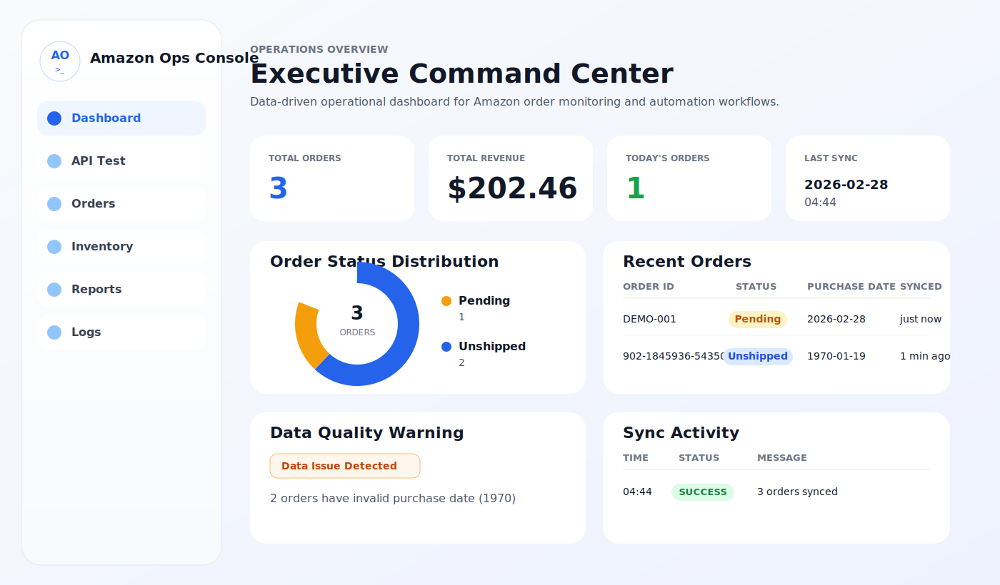

# Amazon Ops Console

Amazon Ops Console은 Amazon 주문 운영 데이터를 조회하고, API 상태를 점검하며, 샌드박스 동기화 작업을 수행할 수 있도록 만든 React + Vite 기반 운영 콘솔 프론트엔드입니다.

이 프로젝트는 단순한 데모 페이지가 아니라, 실제 운영 화면처럼 보이도록 다음 목적에 맞춰 구성되어 있습니다.

- 주문 데이터 모니터링
- 운영 KPI 시각화
- API 헬스체크
- 샌드박스 주문 동기화 테스트
- 주문 데이터 초기화 및 검증

## 스크린샷

아래 이미지는 현재 프로젝트 UI 구조를 설명하기 위한 README용 프리뷰 이미지입니다.



## 주요 기능

- `Dashboard`
  - Orders API 데이터를 기반으로 KPI, 상태 분포, 최근 주문, 데이터 품질 경고를 표시합니다.
- `Orders`
  - 주문 테이블, 상세 패널, 샌드박스 동기화, 전체 주문 삭제 기능을 제공합니다.
- `API Test`
  - 백엔드 헬스체크 엔드포인트(`/dashboard/health`)를 직접 호출하여 상태를 확인합니다.
- `Inventory`, `Reports`, `Logs`
  - 향후 확장을 위한 엔터프라이즈형 모듈 화면을 제공합니다.
- `White / Dark` 테마
  - 상단 토글로 전역 테마를 전환하며, 선택값은 로컬 스토리지에 저장됩니다.

## 기술 스택

- React 19
- Vite 7
- 순수 CSS (외부 UI 프레임워크 미사용)
- Fetch API
- 해시 기반 클라이언트 내비게이션

## 프로젝트 구조

```text
amzops_console/
├─ docs/
│  └─ screenshots/
│     └─ dashboard-preview.svg
├─ public/
│  └─ vite.svg
├─ src/
│  ├─ api/
│  │  ├─ health.js
│  │  └─ orders.js
│  ├─ components/
│  │  └─ layout/
│  │     ├─ PageHeader.jsx
│  │     └─ Sidebar.jsx
│  ├─ pages/
│  │  ├─ ApiTest/
│  │  │  └─ ApiTestPage.jsx
│  │  ├─ Dashboard/
│  │  │  └─ DashboardPage.jsx
│  │  ├─ Inventory/
│  │  │  └─ InventoryPage.jsx
│  │  ├─ Logs/
│  │  │  └─ LogsPage.jsx
│  │  ├─ Orders/
│  │  │  └─ OrdersPage.jsx
│  │  └─ Reports/
│  │     └─ ReportsPage.jsx
│  ├─ App.css
│  ├─ App.jsx
│  ├─ index.css
│  └─ main.jsx
├─ .env
├─ .gitignore
├─ index.html
├─ package-lock.json
├─ package.json
└─ vite.config.js
```

## 폴더 및 파일 설명

### `src/App.jsx`

애플리케이션의 최상위 셸입니다.

- 사이드바 메뉴 정의
- 현재 해시 라우트 해석
- 전역 테마 상태 관리
- 공통 레이아웃(사이드바 + 헤더 + 콘텐츠 영역) 구성

### `src/api`

백엔드 통신 계층입니다.

- `orders.js`
  - 주문 목록 조회
  - 샌드박스 동기화 실행
  - 전체 주문 삭제
  - 공통 API Base URL 관리
- `health.js`
  - `/dashboard/health` 호출
  - 응답 시간(ms) 측정

### `src/components/layout`

공통 레이아웃 컴포넌트입니다.

- `Sidebar.jsx`
  - 브랜드 영역, 좌측 메뉴 렌더링
- `PageHeader.jsx`
  - 페이지 제목 영역, 테마 토글 렌더링

### `src/pages`

기능 단위 화면을 분리한 영역입니다.

- `Dashboard`
  - 주문 데이터 기반 운영 대시보드
- `Orders`
  - 주문 테이블, 상세 패널, 삭제/동기화 기능
- `ApiTest`
  - 헬스체크 테스트 페이지
- `Inventory`, `Reports`, `Logs`
  - 확장용 엔터프라이즈 화면

### `src/App.css`

레이아웃/페이지/컴포넌트 스타일을 담당합니다.

- 사이드바
- 헤더
- KPI 카드
- 도넛 차트
- 주문 테이블
- 상태 배지
- 상세 패널

### `src/index.css`

전역 디자인 토큰과 테마 변수를 관리합니다.

- Light 테마
- Dark 테마
- 전역 컬러 변수
- 전역 요소 스타일
- 모션 및 접근성 관련 설정

## 아키텍처 설명

이 프로젝트는 복잡한 상태 관리 라이브러리 없이, 프론트엔드 운영 콘솔에 필요한 수준으로 단순하고 유지보수하기 쉬운 구조를 목표로 합니다.

### 1. App Shell 구조

`App.jsx`가 공통 셸 역할을 수행합니다.

- 좌측 사이드바
- 상단 헤더
- 중앙 콘텐츠 영역

페이지가 바뀌어도 이 셸은 유지되고, 내부 콘텐츠만 교체됩니다.

### 2. 페이지 단위 분리

각 주요 기능은 `src/pages/<기능명>` 아래에 분리되어 있습니다.

예시:

- `DashboardPage.jsx`
  - 주문 데이터를 읽고 KPI 및 차트를 계산
- `OrdersPage.jsx`
  - 주문 테이블 선택 상태, 삭제, 샌드박스 액션 관리
- `ApiTestPage.jsx`
  - 헬스체크 요청 및 응답 표시

### 3. API 레이어 분리

백엔드 요청 로직은 `src/api`로 분리되어 있습니다.

장점:

- 엔드포인트 중앙 관리
- UI와 네트워크 로직 분리
- 재사용성 증가

### 4. CSS 변수 기반 테마 시스템

`index.css`의 CSS 커스텀 프로퍼티를 통해 Light / Dark 테마를 제어합니다.

장점:

- 컴포넌트 구조 수정 없이 테마 확장 가능
- 색상 일관성 유지
- 유지보수 비용 감소

## 라우팅 구조

이 프로젝트는 별도 라우터 라이브러리 없이 해시 기반 라우팅을 사용합니다.

현재 지원 경로:

- `#/dashboard`
- `#/api-test`
- `#/orders`
- `#/inventory`
- `#/reports`
- `#/logs`

해시가 없으면 기본값으로 `#/dashboard`가 열립니다.

## 현재 사용하는 백엔드 엔드포인트

기본 API Base URL:

- `https://amazon-ops-dashboard.onrender.com`

실제 사용 엔드포인트:

- `GET /orders/`
  - 전체 주문 조회
- `POST /orders/sync-sandbox`
  - 샌드박스 주문 동기화 실행
- `POST /orders/delete-all`
  - 전체 주문 삭제
  - `405` 응답 시 `DELETE /orders/delete-all`로 한 번 더 시도
- `GET /dashboard/health`
  - API 헬스체크

## 환경 변수 설정

프로젝트 루트에 `.env` 파일을 생성합니다.

```env
VITE_API_URL=https://amazon-ops-dashboard.onrender.com
```

주의사항:

- Vite에서 브라우저로 노출되는 환경 변수는 `VITE_` 접두사가 필요합니다.
- 끝에 `/`가 있어도 코드에서 자동으로 정리합니다.

## 로컬 실행 방법

### 1. 패키지 설치

```bash
npm install
```

### 2. 개발 서버 실행

```bash
npm run dev
```

기본 접속 주소:

- `http://localhost:5173`

### 3. 프로덕션 빌드

```bash
npm run build
```

### 4. 빌드 결과 미리보기

```bash
npm run preview
```

## 사용 가능한 스크립트

- `npm run dev`
  - 개발 서버 실행
- `npm run build`
  - `dist/`로 프로덕션 빌드 생성
- `npm run preview`
  - 빌드 결과 로컬 미리보기
- `npm run lint`
  - ESLint 실행

## Dashboard 화면 구성

Dashboard는 실제 `Orders API` 데이터를 사용하여 구성됩니다.

현재 표시 항목:

- `Total Orders`
  - 전체 주문 수
- `Total Revenue`
  - `Amount` 합계
- `Today's Orders`
  - 오늘 주문 수
- `Last Sync`
  - 가장 최근 `synced_at`
- `Order Status Distribution`
  - 주문 상태별 도넛 차트
- `Sync Snapshot`
  - Pending / Unshipped, 최근 동기화 정보
- `Recent Orders`
  - 최근 주문 목록 테이블
- `Data Quality Warning`
  - `purchase_date`가 1970으로 들어온 데이터 탐지

### 상태 차트 동작

도넛 차트는 더 이상 `Pending`, `Unshipped`만 고정으로 보지 않습니다.

실제 `order_status` 값들을 동적으로 집계해서:

- `Pending`
- `Unshipped`
- `Shipped`
- `Delivered`
- `Canceled`
- 기타 커스텀 상태

등이 자동 반영됩니다.

## Orders 화면 구성

Orders 페이지는 운영자가 가장 자주 사용하는 메인 작업 화면입니다.

포함 기능:

- `Orders API` / `Sync Sandbox` 전환
- `Order Table 초기화`
  - 전체 주문 삭제
- KPI 카드
  - Total Orders
  - Pending
  - Unshipped
  - Endpoint
- 주문 테이블
- 선택 행 강조
- 우측 상세 패널
- Raw Response 패널
- Sync Sandbox 실행 결과 표시

### 주문 삭제 동작

`Order Table 초기화` 버튼 클릭 시:

1. 사용자 확인창 표시
2. `/orders/delete-all` 호출
3. 성공 시 주문 데이터 다시 로드
4. 서버 응답을 상단 툴바에 표시

### 주문 값 매핑 기준

현재 UI는 아래와 같은 응답 구조를 직접 읽도록 맞춰져 있습니다.

```json
{
  "id": 39,
  "amazon_order_id": "902-1845936-5435065",
  "order_status": "Unshipped",
  "purchase_date": "1970-01-19T03:58:30+00:00",
  "last_update_date": "1970-01-19T03:58:32+00:00",
  "synced_at": "2026-02-28T04:44:06.893865+00:00",
  "Buyer": "Taylor Kim",
  "Amount": 101.23,
  "Cost": 18.96
}
```

렌더링 규칙:

- `Buyer` → `Buyer`
- `Amount` → `Amount`
- USD 금액 → `$101.23` 형식
- 날짜 → 읽기 쉬운 형식으로 포맷

## API Test 화면 구성

API Test 페이지는 백엔드 상태 점검용입니다.

현재 동작:

- `/dashboard/health` 호출
- 응답 시간(ms) 측정
- HTTP 상태 코드 표시
- 응답 타입 표시
- 응답 payload 표시

## 테마 시스템

상단 우측의 토글을 통해 Light / Dark 테마를 전환할 수 있습니다.

동작 방식:

- 선택값을 `localStorage`의 `amzops-theme`에 저장
- `document.documentElement.dataset.theme`를 갱신
- CSS 변수 기반으로 전체 색상 전환

추가 사항:

- 전환 시 부드러운 애니메이션 적용
- `prefers-reduced-motion` 환경에서는 애니메이션 최소화

## 배포 시 참고 사항

정적 프론트엔드이므로 Vercel 같은 호스팅에 쉽게 배포할 수 있습니다.

배포 시 확인할 것:

- `VITE_API_URL` 설정
- 백엔드 CORS 허용 origin 설정

예시 허용 origin:

- `https://amz-ops-console.vercel.app`
- `http://localhost:5173`

## 확장 아이디어

- Orders 검색 / 필터 / 정렬 기능 추가
- Dashboard에 실제 Sync 로그 시계열 차트 추가
- 인증 및 권한 제어 추가
- 라우트가 더 복잡해지면 React Router 도입
- 차트 요구사항이 커지면 전용 차트 라이브러리 도입

## 정리

Amazon Ops Console은 Amazon 운영 데이터를 빠르게 확인하고, 백엔드 상태를 검증하며, 운영 액션을 수행하기 위한 프론트엔드 콘솔입니다.

이 프로젝트는 다음 기준에 맞춰 설계되었습니다.

- 단순한 구조
- 실제 운영 화면 같은 UI
- API 중심 기능 분리
- 쉽게 확장 가능한 페이지 구조

프론트엔드 운영 콘솔 포트폴리오, 내부 도구 프로토타입, 실무형 대시보드 시작점으로 사용하기 적합합니다.
